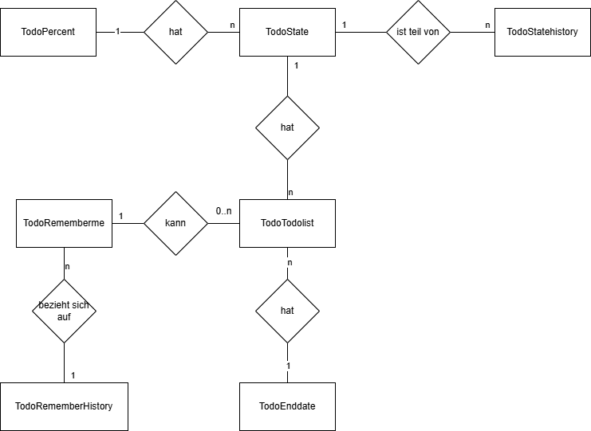
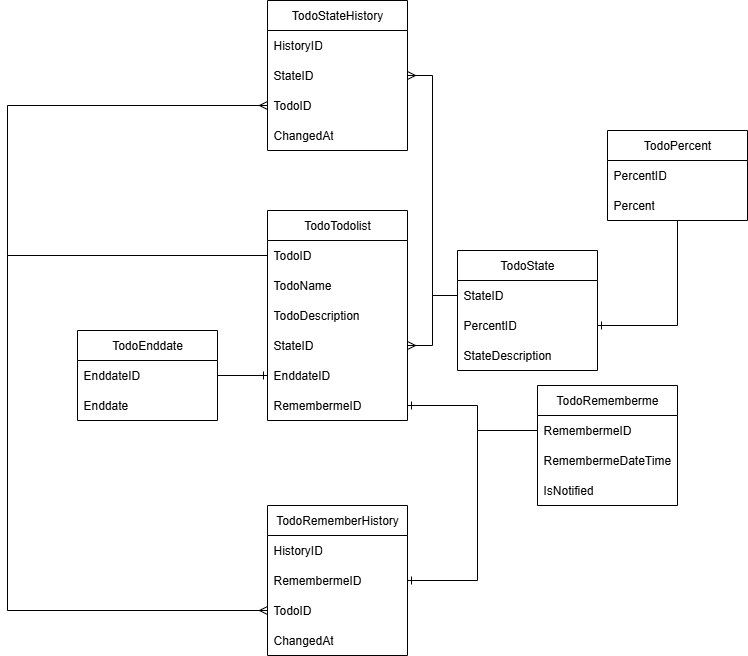

# Modularbeit
Modularbeit für die Teko Bern in Fach Datenbankdesign

Die Datenbank wurde auf einem Raspberry Pi 4 Model B erstellt.
Es handelt sich um einen Apache2-Server mit MariaDB und phpMyAdmin.

## Vorgehen
Mit Raspberry Pi Imager 
  Raspberry Pi OS 64-bit auf SD Karte

### Konsolen Befehle der Konfiguration
sudo apt update

sudo apt upgrade

sudo apt install apache2 libapache2-mod-php php php-mysql mariadb-server -y

sudo systemctl enable apache2
sudo systemctl enable mariadb
sudo systemctl start apache2
sudo systemctl start mariadb

sudo mysql_secure_installation

sudo apt install phpmyadmin -y

sudo ln -s /etc/phpmyadmin/apache.conf /etc/apache2/conf-available/phpmyadmin.conf
#sudo a2enconf phpmyadmin
sudo systemctl reload apache2

pip install mysql-connector-python
sudo nano /etc/mysql/mariadb.conf.d/50-server.cnf
- bind-address = 127.0.0.1
+ bind-address = 0.0.0.0

sudo mysql -u root -p

CREATE USER 'piuser'@'%' IDENTIFIED BY 'root';
GRANT ALL PRIVILEGES ON Modularbeit.* TO 'piuser'@'%';
FLUSH PRIVILEGES;

### Zusatz
Nur nötig wenn per SSH zugegriffen wird Achtung IP Adresse ist diese, die Fix zugewiesen wird:
sudo apt install openssh-server -y
sudo systemctl enable ssh
sudo systemctl start ssh
ssh pi@192.168.0.14
PW: pi

## Router
Über den Router wurde dem Raspberry Pi eine Fixe IP zugewiesen

## Einloggen in PHPMyAdmin und Tabellen erstellen. Alternativ kann auch die Modularbeit.sql importiert werden
-- 1. Prozent-Tabelle
CREATE TABLE TodoPercent (
    PercentID INT NOT NULL AUTO_INCREMENT,
    Percent INT NOT NULL,
    PRIMARY KEY (PercentID)
) ENGINE=InnoDB;

-- 2. Status-Tabelle
CREATE TABLE TodoState (
    StateID INT NOT NULL AUTO_INCREMENT,
    PercentID INT NOT NULL,
    StateDescription VARCHAR(255) NOT NULL,
    PRIMARY KEY (StateID),
    FOREIGN KEY (PercentID) REFERENCES TodoPercent(PercentID)
        ON DELETE RESTRICT ON UPDATE CASCADE
) ENGINE=InnoDB;

-- 3. Enddatum-Tabelle
CREATE TABLE TodoEnddate (
    EnddateID INT NOT NULL AUTO_INCREMENT,
    Enddate DATE NOT NULL,
    PRIMARY KEY (EnddateID)
) ENGINE=InnoDB;

-- 4. Erinnerung-Tabelle
CREATE TABLE TodoRememberme (
    RemembermeID INT NOT NULL AUTO_INCREMENT,
    RememberDateTime DATETIME NOT NULL,
    PRIMARY KEY (RemembermeID)
) ENGINE=InnoDB;

-- 5. Haupttabelle (Todos)
CREATE TABLE TodoTodolist (
    TodoID INT NOT NULL AUTO_INCREMENT,
    TodoName VARCHAR(255) NOT NULL,
    TodoDescription TEXT NOT NULL,
    StateID INT NOT NULL,
    EnddateID INT NOT NULL,
    RemembermeID INT NULL,
    PRIMARY KEY (TodoID),
    FOREIGN KEY (StateID) REFERENCES TodoState(StateID)
        ON DELETE RESTRICT ON UPDATE CASCADE,
    FOREIGN KEY (EnddateID) REFERENCES TodoEnddate(EnddateID)
        ON DELETE RESTRICT ON UPDATE CASCADE,
    FOREIGN KEY (RemembermeID) REFERENCES TodoRememberme(RemembermeID)
        ON DELETE SET NULL ON UPDATE CASCADE
) ENGINE=InnoDB;

-- 6. Statusverlauf-Tabelle
CREATE TABLE TodoStateHistory (
    HistoryID INT NOT NULL AUTO_INCREMENT,
    TodoID INT NOT NULL,
    StateID INT NOT NULL,
    ChangedAt DATETIME NOT NULL DEFAULT CURRENT_TIMESTAMP,
    PRIMARY KEY (HistoryID),
    FOREIGN KEY (TodoID) REFERENCES TodoTodolist(TodoID)
        ON DELETE CASCADE ON UPDATE CASCADE,
    FOREIGN KEY (StateID) REFERENCES TodoState(StateID)
        ON DELETE RESTRICT ON UPDATE CASCADE
) ENGINE=InnoDB;

-- ✅ Prozentwerte von 0 bis 100 in 10er-Schritten einfügen
INSERT INTO TodoPercent (Percent) VALUES 
(0), (10), (20), (30), (40), (50), (60), (70), (80), (90), (100);

## Die Datenbank
### Chendiagram

Hier gilt:

Entities = Rechtecke (z. B. TodoTodolist)

Relationships = Rauten (z. B. „hat“, „kann“)

Attribute (nicht im Bild einzeln dargestellt) hängen normalerweise als Ellipsen an Entities oder Relationships

Die Kardinalitäten (1, n, m) stehen an den Beziehungslinien.

In deiner Datenbank:

Du siehst z. B.:

TodoTodolist „hat“ ein TodoEnddate

TodoTodolist „kann“ ein TodoRememberme haben

TodoState „ist Teil von“ TodoStateHistory

TodoPercent „hat“ TodoState

Das Chen-Modell ist oft theoretischer und gut für Datenmodell-Erklärungen im Unterricht oder für Dokumentationen.

### Crowsfoot

Es zeigt:

Tabellen (Entities) als Rechtecke

Beziehungen (Relationships) als Linien zwischen den Tabellen

Kardinalitäten (1:1, 1:n, m:n) über die Krähenfüsse und Striche an den Linienenden

In deiner Datenbank:

TodoTodolist ist die zentrale Tabelle (enthält die ToDos).

Sie ist per Foreign Keys verbunden mit:

TodoState (Status des ToDos)

TodoEnddate (Enddatum)

TodoRememberme (Erinnerungsdatum)

TodoState hängt an TodoPercent (Prozent-Fortschritt)

Historientabellen (TodoStateHistory, TodoRememberHistory) referenzieren Änderungen an den ToDos oder Erinnerungen.

Das Crowsfoot-Diagramm wird meist verwendet, wenn man Datenbankdesigns mit Tabellen und Kardinalitäten zeigen möchte.

### Datadiagram
| Table               | Column           | DataType     | Nullable   | Default             | Extra          | Key   | References                                     |
|:--------------------|:-----------------|:-------------|:-----------|:--------------------|:---------------|:------|:-----------------------------------------------|
| TodoEnddate         | Enddate          | date         | NO         | nan                 | nan            | nan   | nan                                            |
| TodoEnddate         | EnddateID        | int(11)      | NO         | nan                 | AUTO_INCREMENT | PK    | nan                                            |
| TodoPercent         | Percent          | int(11)      | NO         | nan                 | nan            | nan   | nan                                            |
| TodoPercent         | PercentID        | int(11)      | NO         | nan                 | AUTO_INCREMENT | PK    | nan                                            |
| TodoRememberHistory | ChangedAt        | datetime     | YES        | current_timestamp() | nan            | nan   | nan                                            |
| TodoRememberHistory | RemembermeID     | int(11)      | NO         | nan                 | nan            | nan   | nan                                            |
| TodoRememberHistory | TodoID           | int(11)      | NO         | nan                 | nan            | nan   | nan                                            |
| TodoRememberHistory | HistoryID        | int(11)      | NO         | nan                 | AUTO_INCREMENT | PK    | nan                                            |
| TodoRememberme      | IsNotified       | tinyint(1)   | NO         | 0                   | nan            | nan   | nan                                            |
| TodoRememberme      | RememberDateTime | datetime     | NO         | nan                 | nan            | nan   | nan                                            |
| TodoRememberme      | RemembermeID     | int(11)      | NO         | nan                 | AUTO_INCREMENT | PK    | nan                                            |
| TodoState           | StateDescription | varchar(255) | NO         | nan                 | nan            | nan   | nan                                            |
| TodoState           | PercentID        | int(11)      | NO         | nan                 | nan            | FK    | TodoPercent.PercentID (DEL -, UPD CASCADE)     |
| TodoState           | StateID          | int(11)      | NO         | nan                 | AUTO_INCREMENT | PK    | nan                                            |
| TodoStateHistory    | ChangedAt        | datetime     | NO         | current_timestamp() | nan            | nan   | nan                                            |
| TodoStateHistory    | StateID          | int(11)      | NO         | nan                 | nan            | FK    | TodoState.StateID (DEL -, UPD CASCADE)         |
| TodoStateHistory    | TodoID           | int(11)      | NO         | nan                 | nan            | FK    | TodoTodolist.TodoID (DEL CASCADE, UPD CASCADE) |
| TodoStateHistory    | HistoryID        | int(11)      | NO         | nan                 | AUTO_INCREMENT | PK    | nan                                            |
| TodoTodolist        | RemembermeID     | int(11)      | YES        | nan                 | nan            | nan   | nan                                            |
| TodoTodolist        | TodoDescription  | text         | NO         | nan                 | nan            | nan   | nan                                            |
| TodoTodolist        | TodoName         | varchar(255) | NO         | nan                 | nan            | nan   | nan                                            |
| TodoTodolist        | EnddateID        | int(11)      | NO         | nan                 | nan            | FK    | TodoEnddate.EnddateID (DEL -, UPD CASCADE)     |
| TodoTodolist        | StateID          | int(11)      | NO         | nan                 | nan            | FK    | TodoState.StateID (DEL -, UPD CASCADE)         |
| TodoTodolist        | TodoID           | int(11)      | NO         | nan                 | AUTO_INCREMENT | PK    | nan                                            |

## Fazit
Die Grafiken sowie das Design der Datenbanken wurde selber erstellt
Das meisste des Codes sowie das meiste der Texten in diesem Readme sind von ChatGPT erstellt.
Aufgrund von wenig Zeit für diese Arbeit

